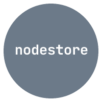

<p align="center">
    
</p>

<p align="center">
  A small state management library based on svelte stores
</p>

<br />

## nodestore

nodestore is small dependencyless state management library, which brings the Stores of sveltejs to node and other frameworks.

It tries to give the basic behaviour of svelte store and expand on it to create a flexible and developer friendly option to manage states in node projects.

## Installation

To install nodestore run

```
npm install nodestore
```

## Usage

nodestore export functions to for creating <a href="">readable</a>, <a href="">writable</a>, <a href="">derived</a> stores.

### writable

```typescript
store = writable(value?: any)
```

```typescript
store = writable(value?: any, start?: (set: (value: any) => void) => () => void)
```

Function that creates a store which has values that can be set from 'outside'.
It gets created as an object with additional set and update methods.

`set` is a method that takes one argument which is the value to be set. The store value gets set to the value of the argument if the store value is not already equal to it.

`update` is a method that takes one argument which is a callback. The callback takes the existing store value as its argument and returns the new value to be set to the store.

<details><summary>Example</summary>

```typescript
import { writable } from "nodestore";

const count = writable(0);

count.subscribe((value) => {
	console.log(value);
}); // logs '0'

count.set(1); // logs '1'

count.update((n) => n + 1); // logs '2'
```

</details>

If a function is passed as the second argument, it will be called when the number of subscribers goes from zero to one (but not from one to two, etc). That function will be passed a `set` function which changes the value of the store. It must return a `stop` function that is called when the subscriber count goes from one to zero.

<details><summary>Example</summary>

```typescript
import { writable } from "nodestore";

const count = writable(0, () => {
	console.log("got a subscriber");
	return () => console.log("no more subscribers");
});

count.set(1); // does nothing

const unsubscribe = count.subscribe((value) => {
	console.log(value);
}); // logs 'got a subscriber', then '1'

unsubscribe(); // logs 'no more subscribers'
```

</details>

Note that the value of a `writable` is lost when it is destroyed, for example when the page is refreshed. However, you can write your own logic to sync the value to for example the `localStorage`.

### readable

```typescript
store = readable(value?: any, start?: (set: (value: any) => void) => () => void)
```

Creates a store whose value cannot be set from 'outside', the first argument is the store's initial value, and the second argument to `readable` is the same as the second argument to `writable`.

<details><summary>Example</summary>

```typescript
import { readable } from "nodestore";

const time = readable(null, (set) => {
	set(new Date());

	const interval = setInterval(() => {
		set(new Date());
	}, 1000);

	return () => clearInterval(interval);
});

time.subscribe((value) => {
	console.log(value);
}); // logs current timestamp every second
```

</details>

### Conditined Subscription

`readable` and `writable`, bot have the option to create a conditioned `subscribe` function, which will only be called when the given condition is met.

<details><summary>Example writable</summary>

```typescript
import { writable } from "nodestore";

const count = writable(0);

count.conditioned(2, (value) => {
	console.log(value);
}); // Will not be called init

count.set(1); // doesn't log anything

count.update((n) => n + 1); // logs '2'
```

</details>

<details><summary>Example readable</summary>

```typescript
import { readable } from "nodestore";

let count = 0;

const counter = readable(null, (set) => {
	set(count);

	const interval = setInterval(() => {
		count += 1;
		set(count);
	}, 1000);

	return () => clearInterval(interval);
});

counter.conditioned(3, (value) => {
	console.log("Conditon met");
}); // logs 'Condition met' after 3 seconds
```

</details>

### derived

```typescript
store = derived(a, callback: (a: any) => any)
```

```typescript
store = derived(a, callback: (a: any, set: (value: any) => void) => void | () => void, initial_value: any)
```

```typescript
store = derived([a, ...b], callback: ([a: any, ...b: any[]]) => any)
```

```typescript
store = derived([a, ...b], callback: ([a: any, ...b: any[]], set: (value: any) => void) => void | () => void, initial_value: any)
```

Derives a store from one or more other stores. The callback runs initially when the first subscriber subscribes and then whenever the store dependencies change.

In the simplest version, `derived` takes a single store, and the callback returns a derived value.

<details><summary>Example</summary>

```typescript
import { derived } from "nodestore";

const doubled = derived(a, ($a) => $a * 2);
```

</details>

The callback can set a value asynchronously by accepting a second argument, set, and calling it when appropriate.

In this case, you can also pass a third argument to `derived` — the initial value of the derived store before `set` is first called.

<details><summary>Example</summary>

```typescript
import { derived } from "nodestore";

const delayed = derived(
	a,
	($a, set) => {
		setTimeout(() => set($a), 1000);
	},
	"one moment..."
);
```

</details>

If you return a function from the callback, it will be called when a) the callback runs again, or b) the last subscriber unsubscribes.

<details><summary>Example</summary>

```typescript
import { derived } from "nodestore";

const tick = derived(
	frequency,
	($frequency, set) => {
		const interval = setInterval(() => {
			set(Date.now());
		}, 1000 / $frequency);

		return () => {
			clearInterval(interval);
		};
	},
	"one moment..."
);
```

</details>

In both cases, an array of arguments can be passed as the first argument instead of a single store.

<details><summary>Example</summary>

```typescript
import { derived } from "nodestore";

const summed = derived([a, b], ([$a, $b]) => $a + $b);

const delayed = derived([a, b], ([$a, $b], set) => {
	setTimeout(() => set($a + $b), 1000);
});
```

</details>

### get

```typescript
value: any = get(store);
```

Generally, you should read the value of a store by subscribing to it and using the value as it changes over time. Occasionally, you may need to retrieve the value of a store to which you're not subscribed. `get` allows you to do so.

<details><summary>Example</summary>

```typescript
import { get } from "nodestore";

const value = get(store);
```

</details>

## Contribution

When contributing to this repository, please first discuss the change you wish to make via GitHub Discussions with the owners of this repository before submitting a Pull Request.

- [MIT License](https://github.com/maddeye/nodestore/blob/main/LICENSE)

## No depency lock

Lock files like `package-lock.json` are helpful for deployed applications. They ensure that dependencies are consistent between environments and across deployments.

Packages like `nodestore` that get published to the npm registry do not include lock files. `npm install nodestore` as a user will respect version constraints in nodestore's package.json. nodestore and its dependencies will be included in the user's lock file if one exists, but nodestore's own lock file would not be used.

We intentionally don't lock dependency versions so that we have the latest compatible dependency versions in development and CI that our users get when installing nodestore in a project.
